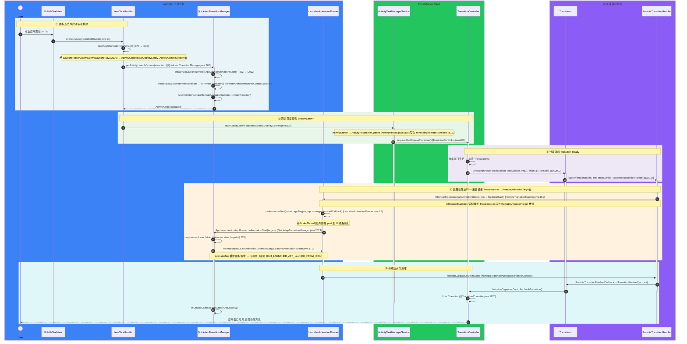

# 14 - 应用启动与远程动效时序图

> 源码树：`/Users/soycodetrail/aosp-r4`（android-16.0.0_r4）
> 整理日期：2026-07-22
> 范围：点击桌面图标 → Launcher 构建启动选项（附带 RemoteAnimation runner）→ 跨进程提交 ATMS → WMS Transitions 就绪 → Shell 兼容桥接 → Launcher 执行图标→应用窗口展开动效 → 结束回调
> 所有类名/方法名均经 grep 在源码中核对；`file:line` 对应当前源码树。
> 交互式 HTML（平移缩放/点击复制/逐帧播放）：`~/aosp-r4/Documents/launcher-remote-animation/launcher-app-open-remote-animation.html`
> 相关笔记：[[00-Launcher3源码精读总览]] · [[09-动画系统]] · [[SurfaceFlinger 单帧合成流程时序图]] · [[20-system_server 精读方案]]

## 关键架构事实（此版本 aosp-r4 / Android 16）

1. **WMS 已彻底迁移到「服务端 Transitions」系统**：`TransitionController` / `Transition` / `ITransitionPlayer` / `IRemoteTransition` / `TransitionInfo`。旧的 `RemoteAnimationController`、WM 侧 `RemoteAnimationAdapter`、`AppTransition` 在本分支**已不存在**（`AppTransition.isReady()` 之类的旧教材写法全部失效）。
2. **Launcher3 仍用旧版 `IRemoteAnimationRunner` / `RemoteAnimationTarget` API**，靠 **Shell 层**桥接：`RemoteAnimationRunnerCompat.toRemoteTransition()`（`RemoteAnimationRunnerCompat.java:76`）把旧 runner 包成现代 `IRemoteTransition`；`RemoteTransitionHandler.startAnimation()`（`RemoteTransitionHandler.java:117`）把 `TransitionInfo` 转成 `RemoteAnimationTarget[]` 后回调 `LauncherAnimationRunner.onAnimationStart(...)`。
3. **App-OPEN（打开应用）动效是「每次启动按需附带」的**，不是全局注册。点击链路在 `QuickstepTransitionManager.getActivityLaunchOptions()`（`QuickstepTransitionManager.java:362`）里把 runner 打包进 `ActivityOptions.makeRemoteAnimation(...)` 随 `startActivity` 一起提交。启动期 `registerRemoteAnimations()`（`QuickstepLauncher.java:357`）注册的是**反方向**（app→回桌面，`WallpaperOpenLauncherAnimationRunner`，处理 `TRANSIT_OLD_WALLPAPER_OPEN`）。
4. **runner 没有 `onAnimationEnd`**：`IRemoteAnimationRunner` 只有 `onAnimationStart` / `onAnimationCancelled`。动画结束通过 `AnimationResult`（`extends IRemoteAnimationFinishedCallback.Stub`，`LauncherAnimationRunner.java:131`）回调到 Shell，再到 WMS `TransitionController.finishTransition`。
5. **图标点击启动不经过 `ActivityManagerWrapper`**（那是 Recents 任务管理用的）；走标准 `context.startActivity(intent, optionsBundle)`（`ActivityContext.java:530`）。
6. `RemoteAnimationTarget` 字段叫 `screenSpaceBounds`，**没有** `screenBounds`（`RemoteAnimationTarget.java:176`）。

---

## 一、Mermaid 时序图



---

## 二、编号调用序列（带 `file:line`）

### ① Launcher 应用进程：图标点击 → 启动选项

```
 1. BubbleTextView   点击图标,OnClickListener = getItemOnClickListener()  Launcher.java:3045
 2. QuickstepLauncher onItemClicked → super.getItemOnClickListener().onClick  QuickstepLauncher.java:524
 3. ItemClickHandler onClick(view)                                      ItemClickHandler.java:91
 4. ItemClickHandler  WorkspaceItemInfo → onClickAppShortcut            ItemClickHandler.java:353
 5. ItemClickHandler  startAppShortcutOrInfoActivity                    ItemClickHandler.java:377 → :422
 6. Launcher          startActivitySafely(v, intent, item)              Launcher.java:2106 → super :2136
 7. ActivityContext   startActivitySafely (default)                     ActivityContext.java:496
 8. ActivityContext   getActivityLaunchOptions(v, item)                 ActivityContext.java:512 / :563
 9. QuickstepLauncher → mAppTransitionManager.getActivityLaunchOptions  QuickstepLauncher.java:1368
10. QuickstepTransitionManager getActivityLaunchOptions(view, item)     QuickstepTransitionManager.java:362
11.   createAppLaunchRunner(v, onEndCallback)                           QuickstepTransitionManager.java:422
        - new AppLaunchAnimationRunner(v, onEndCallback)                QuickstepTransitionManager.java:2002
        - new LauncherAnimationRunner(mHandler, mAppLaunchRunner, true) startAtFrontOfQueue=true
12.   createAppLaunchRemoteTransition(appLaunchRunner)                  QuickstepTransitionManager.java:440
        - appLaunchRunner.toRemoteTransition() → IRemoteTransition      RemoteAnimationRunnerCompat.java:76
13.   ActivityOptions.makeRemoteAnimation(adapter, remoteTransition "QuickstepLaunch")
14. ActivityContext   context.startActivity(intent, optionsBundle) [IPC] ActivityContext.java:530
```

### ② SystemServer / WMS：提交 → 过渡就绪

```
15. ActivityTaskManagerService  startActivity (binder 入口)
16. ActivityStarter → ActivityRecord.setOptions(options)               ActivityRecord.java:5116
      - mPendingRemoteAnimation = options.getRemoteAnimationAdapter()  :5120
      - mPendingRemoteTransition = options.getRemoteTransition()       :5122
17. ActivityRecord.applyOptionsAnimation                                ActivityRecord.java:5125
18. TransitionController.requestStartDisplayTransition(...)             TransitionController.java:839
19. (player 回调) ITransitionPlayer.requestStartTransition              TransitionController.java:2029
20. WMS 收集窗口变更 → Transition 构造 TransitionInfo
21. Transition  ITransitionPlayer.onTransitionReady(token, info, t, finishT)  Transition.java:2092
```

### ③ Shell 兼容桥接：TransitionInfo → RemoteAnimationTarget[]

```
22. Transitions (implements ITransitionPlayer) onTransitionReady        Transitions.java:137
23. Transitions  选 Handler → startAnimation 分发                       Transitions.java:1037 / :1074
24. RemoteTransitionHandler startAnimation(token, info, startT, finishT) RemoteTransitionHandler.java:117
25. RemoteTransitionHandler remote.getRemoteTransition().startAnimation  RemoteTransitionHandler.java:181
26. IRemoteTransition.startAnimation (由 toRemoteTransition 产生)
      - 内部把 TransitionInfo → RemoteAnimationTarget[] (apps/wp/nonApps)
```

### ④ Launcher 执行：远程动效（核心）

```
27. LauncherAnimationRunner onAnimationStart (Binder 线程)              LauncherAnimationRunner.java:82
        参数: transit, appTargets[], wallpaperTargets[], nonApps[], finishedCallback
28. LauncherAnimationRunner post 到 UI 线程 → getFactory().onAnimationStart
29. AppLaunchAnimationRunner onAnimationStart(targets)                  QuickstepTransitionManager.java:2013
        - launcherIsATargetWithMode / isLaunchingFromRecents 判定来源
30.   (图标) composeIconLaunchAnimator(anim, mV, targets...)            QuickstepTransitionManager.java:526
        (Widget) composeWidgetLaunchAnimator   (Recents) composeRecentsLaunchAnimator
31.   addCujInstrumentation(anim, CUJ_LAUNCHER_APP_LAUNCH_FROM_ICON)
32.   result.setAnimation(anim, mLauncher, mOnEndCallback, skipFirstFrame) LauncherAnimationRunner.java:171
33. AnimatorSet 播放: 图标缩放 → 应用窗口展开
```

### ⑤ 结束与清理

```
34. AnimatorSet 结束 → AnimationResult.onAnimationFinished()            LauncherAnimationRunner.java:190 (:131 .Stub)
        (AnimationResult extends IRemoteAnimationFinishedCallback.Stub)
35. Shell 收到 → IRemoteTransitionFinishedCallback.onTransitionFinished(wct, sct)
36. IWindowOrganizerController.finishTransition → TransitionController.finishTransition  TransitionController.java:1075
37. AppLaunchAnimationRunner onAnimationCancelled / mOnEndCallback.executeAllAndDestroy (兜底)
38. 应用窗口正式可见,Task 进入 ACTIVE
```

> 取消路径：若中途取消（超时/抢占），WMS 经 `Transition.abort()` / `postCleanupOnFailure()`，
> 回调 `LauncherAnimationRunner.onAnimationCancelled()`（`LauncherAnimationRunner.java:118`）→
> `AppLaunchAnimationRunner.onAnimationCancelled()`（`:2063`）执行 `mOnEndCallback` 兜底。

---

## 三、涉及的关键文件

| 模块 | 文件 |
|------|------|
| Launcher 入口/分发 | `Launcher3/src/com/android/launcher3/{Launcher.java,views/ActivityContext.java,touch/ItemClickHandler.java}` |
| Launcher Quickstep | `Launcher3/quickstep/src/com/android/launcher3/uioverrides/QuickstepLauncher.java` |
| 转场管理 | `Launcher3/quickstep/src/com/android/launcher3/QuickstepTransitionManager.java`（含 `AppLaunchAnimationRunner` `WallpaperOpenLauncherAnimationRunner` `ContainerAnimationRunner`） |
| 远程动效 runner | `Launcher3/quickstep/src/com/android/launcher3/LauncherAnimationRunner.java`（`RemoteAnimationFactory` / `AnimationResult`） |
| 兼容桥接 | `frameworks/base/packages/SystemUI/animation/src/com/android/systemui/animation/RemoteAnimationRunnerCompat.java` |
| Shell Transitions | `frameworks/base/libs/WindowManager/Shell/src/com/android/wm/shell/transition/{Transitions.java,RemoteTransitionHandler.java}` |
| WMS Transitions | `frameworks/base/services/core/java/com/android/server/wm/{TransitionController.java,Transition.java,ActivityRecord.java}` |
| AIDL 定义 | `frameworks/base/core/java/android/view/{IRemoteAnimationRunner.aidl,IRemoteAnimationFinishedCallback.aidl,RemoteAnimationTarget.java}` · `frameworks/base/core/java/android/window/{IRemoteTransition.aidl,IRemoteTransitionFinishedCallback.aidl,TransitionInfo.java}` |

---

## 四、与 SurfaceFlinger 时序图的对照

| 维度 | 应用启动远程动效 | [[SurfaceFlinger 单帧合成流程时序图]] |
|------|----------------|--------------------------------------|
| 触发 | 用户点击（事件驱动，一次性） | VSYNC（周期性，每帧） |
| 跨进程 | Launcher ↔ SystemServer ↔ Shell（3 进程 binder） | App ↔ SF（2 进程 binder + fence） |
| 同步原语 | `IRemoteAnimationFinishedCallback` / `onTransitionFinished` | acquire/release/present fence |
| 关键迁移 | 旧 `RemoteAnimationController` → 新 `TransitionController` + Shell 桥接 | 旧 `onMessageReceived` → 新 Scheduler 双相 `commit/composite` |

**标签：** #Launcher3 #远程动效 #WindowManager #Transitions #AOSP源码精读
